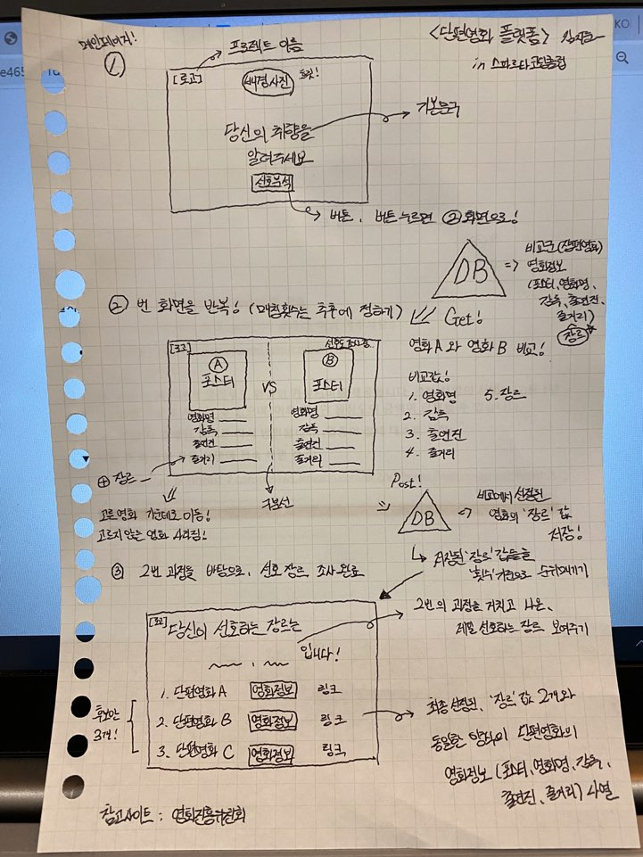

# 📌 프로젝트 이름 : ART_Cinema 🎞

당신만을 위한 단편영화 추천 서비스

 

> 📌 설명

인지도가 높은 장편영화를 바탕으로, 장르를 기준으로 배열되는 매칭을 통해서 선정된 사용자의 선호영화의 장르 값들을 모아서 사용자의 장르를 파악한다. 

이후, 나온 결과값들을 바탕으로, 해당하는 장르의 단편영화를 추천해주고 사용자가 링크를 통해서 바로 단편영화를 볼 수 있게 만든다.

  

> 💡 기획의도

: 열정은 있지만, 기회가 주어지지 않아 노력해도 앞으로 나아갈 수 없는 상황을 조금이라도 해소하고자 서비스를 만들게 되었다. 다른 분야들 또한 그러하겠지만, 특히 예체능 계열의 상황은 더 심각한 상황에 놓여있다. 얼마만 내면 대학교에 들어갈 수 있고, 실력보다는 혈연/지연/학연에 의해서 굴러가고 있는 생태계이기에, 그렇지 못한 사람들을 자연스럽게 포기하게 되는 상황에 놓여져있다.

최근, 각종 영화제를 휩쓸고 다니는 '봉준호 감독' 또한, 기회가 주어지지 않았다면 본인의 재능과 역량을 표현할 수 없었고 이런 파급력을 불러일으킬 수도 없었을 것이다. 앞으로 이런 영향력을 가져올 잠재성을 갖춘 사람들은 많겠지만, 상황이 뒤받쳐주지 못하기에 아직 대한민국 영화계의 전망은 너무나도 힘든 상황이라고 생각한다.

이러한 구조를 끊기 위해서는, 결국 새로운 감독/배우/연출진들이 도전해보고 자신의 생각을 표현할 수 있는 수단이 필요한데, 이러한 생각들을 보통 독립영화로 많이 표현해낸다.
하지만, 독립영화 또한, 감독 자신만의 색깔을 강하게 들어내기에, "상업성"이라는 영화의 중요한 측면에서는 흥행하기가 어려운 것 또한 현실이다.

영화란, "상업성" 즉, 이익을 얼마나 창출할 수 있는가도 중요하고, "창의성" 얼마나 새로운 구도로 바라보는가 또한 중요하다.(상업적인 목적으로 만들어진 영화를 비하하는 의도는 아니다.) 하지만, 지금의 상황은 오로지, 돈이 되는 상업영화만을 위한 영화계가 되어버렸고 돈이 벌리지 못하는 독립영화는 뒤쳐지고 도태되고 있는 상황이다. 이러한 불균형적인 상황을 극복하고자 독립영화를 많이 수요할 수 있게 된다면 어느정도 극복할 수 있는 상황이지않을까? 라는 생각이 들던 도중, "독립영화를 추천해주고 볼 수 있는 사이트를 만들어볼까?" 하는 생각이 불현듯이 들었고 이를 착안해서 프로젝트를 기획하게 되었다.

 

> https://youtu.be/nYmu2pUTSDs
(프로젝트 설정에 가장 큰 영향을 받은 유튜브 영상)

 
> 단편영화 수요 ↑ => 영화에 대한 배급사의 선택지 ↑ (다양한 영화가 더 나올 수 있음) => 영화 제작에 있어서, 감독의 재량 ↑ => 다양한 출연진과 연출진들에게 기회 ↑ => 영화산업계 변화

  

> 📜 구상도

  

> 🔨 빌드업

(프론트)
HTML, CSS, Javascript(ES6)

(백엔드)
Flask, Python, MongoDB

AWS, 가비아, Filezilla

  

> 🌟 기능

- (★) 사용자의 선호 장르 조사를 위한, 비교할 장편영화 영화정보 DB 저장 (크롤링 활용 : BeautifulSoup , Selenium 사용) (네이버 영화랭킹 활용)

https://movie.naver.com/movie/sdb/rank/rmovie.nhn?sel=pnt&date=20200213&tg=0 (네이버 영화 랭킹)

- (★)어떤 장르의 영화를 비교함으로써, 선호 장르 값을 얻을 것인지 알고리즘 설계
- 구상도 '2번' 의 과정을 얼마나 반복할 것인지 계획 (많으면 많을수록 더 정확해지기에 좋음)
- 최종적으로 나온 사용자의 선호장르 결과값과 그에 해당하는 장르의 단편영화 정보 크롤링 (Selenium 사용) ("영화진흥위원회" 사이트 활용)

http://www.kobis.or.kr/kobis/business/mast/mvie/findDiverMovList.do (영화진흥위원회)

- 최종적으로 선정된 단편영화 3개를 볼 수 있는 링크를 연동 (바로 링크를 타고 들어가서 볼 수 있게 만들기)

- 로그인/로그아웃

- 마이페이지 기능

- 영화 좋아요 / 댓글 기능

  

> 🗂 참고 사이트
> (단편영화 링크 참고)
1. https://www.youtube.com/results?search_query=%EB%8B%A8%ED%8E%B8%EC%98%81%ED%99%94 (유튜브 "단편영화" 검색)

2. https://tv.naver.com/indiecinema/playlists (네이버 인디극장)

3. http://www.cinehubkorea.com/ (씨네허브)

4. https://tv.naver.com/kartsmovie (한국예술종합학교 영화과)

5. https://www.indieplug.net/movie/db_list.php (인디플러그)

  

> 📔 개발일지

1. https://velog.io/@kks1342320/series/%EC%8A%A4%ED%8C%8C%EB%A5%B4%ED%83%80%EC%BD%94%EB%94%A9%ED%81%B4%EB%9F%BD-%EA%B0%9C%EB%B0%9C%EC%9D%BC%EA%B8%B0 
(velog 개발일지 ①)

2. https://velog.io/@kks1342320/series/ARTCinema-%EA%B0%9C%EB%B0%9C%EB%85%B8%ED%8A%B8
(velog 개발일지 ②)

3. https://juni-dev-log.tistory.com/category/Project/ART_Cinema%28Dev%29
(티스토리 개발일지)